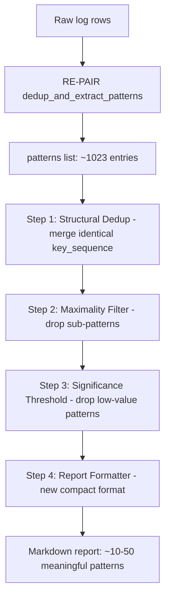

# Plan: Improving the Repeated Patterns Report

## Problem Statement

The current report generates **1023 patterns** from a single log export, with the vast majority being meaningless to a human analyst. Two symptoms dominate:

1. **Sub-pattern explosion** — RE-PAIR recursively splits a 147-line block into ~73 intermediate "pair" rules (R1=line1+line2, R2=R1+line3, …), all of which land in the patterns dictionary as separate entries.
2. **Structural duplicates** — Pattern #497 and Pattern #499 are *the same* repeating behaviour (same device `3050334596`, same component `TransactionPersistenceHandler`, same sequence of `writeJob enter → CreateFile failed → writeJob exit`) but were triggered at different 1-minute offsets, causing RE-PAIR to build them as separate rule hierarchies.

---

## Root Cause Analysis

### RE-PAIR's rule-explosion problem

RE-PAIR builds rules **bottom-up from adjacent pairs**. For a 147-line block repeating 8×:

```
Block = [L1, L2, L3, …, L147]   (8 occurrences each)

Round 1:  (L1, L2) → R1       repeat_count = 8 × 73 = 584
Round 2:  (R1, L3) → R2       repeat_count = 8 × 72 = 576
...
Round 73: R72 = [L1..L146]
Round 74: (R72, L147) → R73   repeat_count = 8
```

**Result**: 73+ `DictionaryEntry` objects, one per round. Every intermediate rule appears in the report as a "Pattern" with its own block listing. The only entry meaningful to a human is the *last* one — the 147-line maximal pattern repeated 8 times.

### Structural-duplicate problem

Because two 147-line patterns start at different positions (lines 26543 and 26786), RE-PAIR encounters them at different points in its sequential scan and builds *independent* rule hierarchies for each. The key sequences are fingerprint-identical (same `hash_lo`/`hash_hi` per line), but they get separate `rule_id`s and separate `DictionaryEntry` objects.

---

## Proposed Solutions (Brainstorm)

### Option A — Post-processing: Maximality Filter ⭐
After `_build_patterns_from_result`, discard any pattern whose `key_sequence` is a *sub-sequence prefix or suffix* of a longer pattern in the list.

- **How**: Sort by `pattern_length` DESC. For each pattern, check whether its key_sequence appears as a contiguous subsequence inside any already-accepted pattern.
- **Result**: For a 147-line block, only the top-level rule survives; all 72 intermediates are dropped.
- **Complexity**: O(P² × L) where P = pattern count, L = max pattern length. With RE-PAIR typically generating O(N/2) rules of O(1..N) length, this is manageable.

### Option B — Post-processing: Structural Deduplication ⭐
Hash each pattern's `key_sequence` tuple. Group patterns with identical hashes into one entry, merging their `occurrences` lists.

- **How**: `key = tuple(entry.key_sequence)` → deduplicate.
- **Result**: Pattern #497 and Pattern #499 become one entry "Repeated 16 times" instead of two "Repeated 8 times" entries.
- **Note**: Occurrences must be re-sorted and deduplicated after merging.

### Option C — Significance Threshold Filter
Only keep patterns where `repeat_count × pattern_length ≥ threshold` (e.g. 50).

- **Result**: Filters out tiny leaf-node rules (e.g. a 2-line rule repeating 584 times is kept; a 3-line rule repeating 2 times is dropped).
- **Risk**: Might discard rare but important patterns. Should be configurable, not hard-coded.

### Option D — Hierarchical Report Format
Don't flatten the RE-PAIR tree — present top-level rules collapsed with their sub-rules as expandable children.

- **How**: After RE-PAIR, walk the rule tree from root to leaves, only emitting root-level nodes in the report. Sub-patterns are referenced as "Built from sub-patterns #R1, #R2".
- **Downside**: Requires restructuring `DictionaryEntry` and `GroupingResult`.

### Option E — Algorithm Change: Direct Maximal Repeats
Replace RE-PAIR with a suffix-array based "maximal repeat" finder that directly produces only the longest non-overlapping repeating blocks, without intermediate rules.

- **Upside**: Cleaner output by design.
- **Downside**: Larger implementation effort, higher algorithmic complexity.

### Option F — Report Format Overhaul
Keep the algorithm as-is but radically change the output:
- **Executive summary**: one table of "wasted lines" per device/component.
- **Top-N patterns only**: configurable limit (default 20 or 50).
- **Collapsible block content**: show only first 5 lines of a block, with "… (N more lines)" for long blocks.

---

## Recommended Plan: Combine A + B + C + F

These four options are additive (not mutually exclusive), work at the post-processing level (no algorithm change needed), and deliver the most value for the least complexity.

### Pipeline flow



---

## Implementation Plan

### Step 1 — New helper: `deduplicate_patterns` in `neuf_log_viewer_api.py`

```python
def _deduplicate_patterns(patterns):
    # Group by frozen key_sequence tuple, merge occurrences
    seen = {}
    for p in patterns:
        key = tuple(p['_key_sequence'])
        if key in seen:
            seen[key]['occurrences'].extend(p['occurrences'])
            seen[key]['repeat_count'] = len(seen[key]['occurrences'])
        else:
            seen[key] = dict(p)
    result = list(seen.values())
    for p in result:
        p['occurrences'].sort(key=lambda o: o['line'])
    return result
```

Requires: `_build_patterns_from_result` must preserve `_key_sequence` on each pattern dict (currently stored as `block_rows` → need to also carry the raw key tuple).

### Step 2 — New helper: `filter_maximal_patterns` in `neuf_log_viewer_api.py`

```python
def _filter_maximal_patterns(patterns):
    # Sort longest first
    patterns = sorted(patterns, key=lambda p: p['pattern_length'], reverse=True)
    maximal = []
    accepted_keys = []
    for p in patterns:
        seq = tuple(p['_key_sequence'])
        # Check if seq is a contiguous sub-sequence of any already-accepted pattern
        dominated = any(
            _is_subsequence(seq, ak)
            for ak in accepted_keys
        )
        if not dominated:
            maximal.append(p)
            accepted_keys.append(seq)
    return maximal
```

### Step 3 — Significance threshold in `_format_patterns_markdown`

Add an optional `min_significance` parameter (default: `pattern_length * repeat_count >= 10`). Patterns below threshold are listed only in a summary table, not expanded in full.

### Step 4 — Redesigned report format

New report structure:

```markdown
# NEUF Log — Repeated Patterns Report
**Generated:** ...  
**Total raw patterns detected:** 1023  
**After deduplication and filtering:** 12 meaningful patterns  

---

## Executive Summary

| Rank | Device | Component | Pattern Lines | Repeats | Total Wasted Lines |
|------|--------|-----------|---------------|---------|-------------------|
| 1    | 3050334596 | TransactionPersistenceHandler | 147 | 16× | 2352 |
| 2    | ...    | ...       | ...           | ...     | ...               |

---

## Pattern Details

### Pattern 1 — 147 lines × 16 repeats = 2352 wasted lines

**Component:** `TransactionPersistenceHandler`  
**Device:** `3050334596`  
**Summary:** `writeJob enter → CreateFile failed → writeJob exit` (cycle of 5 lines × 29 cycles per block)

**Block preview (first 5 lines):**
```
...first 5 lines...
```
_… (142 more lines)_

**All occurrences (16):**
| # | Line | Timestamp |
...
```

---

## Changes Required

### `src/neuf_log_service.py`
- `_build_patterns_from_result`: Add `_key_sequence` field to each pattern dict so post-processing steps can compare fingerprint sequences.

### `neuf_log_viewer_api.py`
- Add `_deduplicate_patterns(patterns)` helper (Option B).
- Add `_filter_maximal_patterns(patterns)` helper (Option A).
- Add `_filter_by_significance(patterns, min_score)` helper (Option C).
- Rewrite `_format_patterns_markdown` with new executive summary + top-N detail format (Option F).
- Wire all three post-processing steps into the `export_log` handler before `_format_patterns_markdown` is called.

### Configuration (optional)
Add two new query parameters to the `ExportLogRequest` Pydantic model:
- `max_patterns: int = 50` — cap the number of patterns shown in full.
- `min_pattern_significance: int = 10` — minimum `repeat_count × pattern_length` to include.

---

## Expected Output Impact

| Metric | Before | After |
|--------|--------|-------|
| Total patterns in report | 1023 | ~10–50 |
| Pattern #497 + #499 | 2 separate entries | 1 merged entry (16 repeats) |
| Sub-pattern entries | ~970 | 0 |
| Report file size | Large | ~80% smaller |
| Human readability | Low | High |
